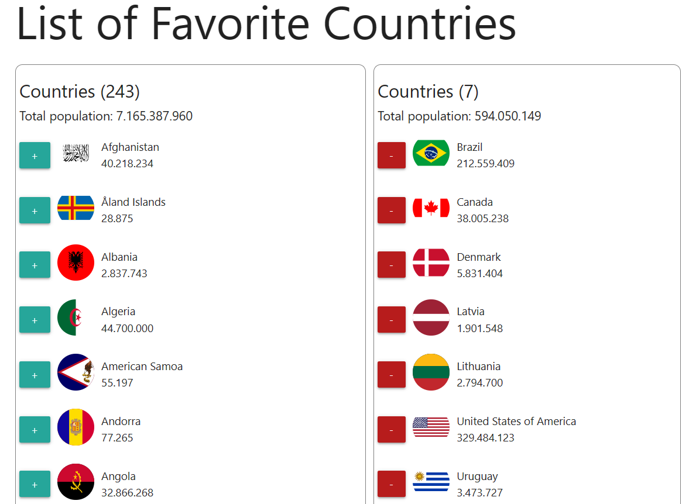

# Favorite Countries Web Application

Welcome to the Favorite Countries web application! This application allows you to create a list of your favorite countries and view their populations. You can easily add countries from around the world using data from the [Rest Countries API](https://restcountries.com/v2/all).

## Features

- **Add Favorite Countries:** You can add your favorite countries to the list using data from the Rest Countries API.
- **View Population:** For each country added to the list, you can view its population.
- **Total Population:** The application also displays the total population of all your favorite countries combined.

## Technologies Used

This web application is built using the following technologies:

- **HTML5:** For the structure of the web page.
- **CSS:** For styling the user interface.
- **Vanilla JavaScript:** For interacting with the DOM and fetching data from the countries list.

## Getting Started

To get started with the application, simply download or clone the repository to your local machine. Then, open the `index.html` file in your web browser to start using the application.

## How to Use

1. **Add a Country:** Click on the plus sign button to add the country to your favorite countries list.
2. **Total Population:** The total population of all your favorite countries will be shown at the bottom of the list.

## Preview

## Support

If you encounter any issues or have any questions, feel free to reach out to [Lucas Braga](lucasbbs@live.fr).

Enjoy exploring your favorite countries with this simple and fun web application! 🌍🎉
